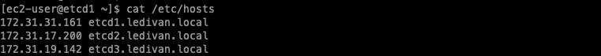
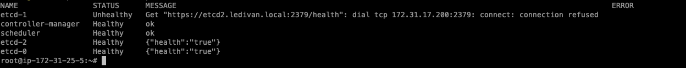
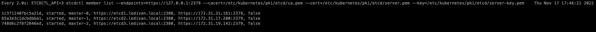
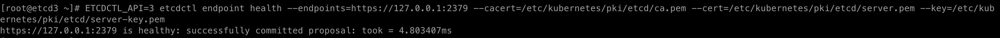
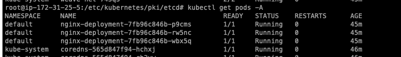

# Introduction
In this post I will show how to configure Kubernetes etcd in high availability.

Also how to recover if some of the etcd nodes fail.

# Prerequisites

For this lab, we will use a standard Ubuntu 20.04 installation as a base image for the seven machines needed.

We also need three main nodes of the ETCD cluster. These machines will have the IPs  172.31.31.161, 172.31.17.200 and 172.31.19.142.

Finally, we will also have three Kubernetes worker nodes with the IP 172.31.20.90.

We also need an IP range for the pods. This range will be 10.30.0.0/16, but it is only internal to Kubernetes.

We also need three Kubernetes main nodes. These machine will have the IP 172.31.25.5.

# Configuration on ETCD nodes

```bash
host: 172.31.31.161
hostnamectl set-hostname etcd1

host: 172.31.17.200
hostnamectl set-hostname etcd2

host: 172.31.19.142
hostnamectl set-hostname etcd3

apt update && apt upgrade -y

reboot
```

Configure /etc/hosts

<center></center>

```bash
vim  /etc/hosts
172.31.31.161 etcd1.ledivan.local
172.31.17.200 etcd2.ledivan.local
172.31.19.142 etcd3.ledivan.local
```

```bash
wget -q --show-progress --https-only --timestamping \
  https://storage.googleapis.com/kubernetes-the-hard-way/cfssl/1.4.1/linux/cfssl \
  https://storage.googleapis.com/kubernetes-the-hard-way/cfssl/1.4.1/linux/cfssljson

chmod +x cfssl cfssljson
sudo mv cfssl cfssljson /usr/local/bin/
```

```bash
mkdir -p /etc/kubernetes/pki/etcd
cd /etc/kubernetes/pki/etcd
```
# Create ca-config.json file in /etc/kubernetes/pki/etcd folder with following content.

```json
{
    "signing": {
        "default": {
            "expiry": "43800h"
        },
        "profiles": {
            "server": {
                "expiry": "43800h",
                "usages": [
                    "signing",
                    "key encipherment",
                    "server auth",
                    "client auth"
                ]
            },
            "client": {
                "expiry": "43800h",
                "usages": [
                    "signing",
                    "key encipherment",
                    "client auth"
                ]
            },
            "peer": {
                "expiry": "43800h",
                "usages": [
                    "signing",
                    "key encipherment",
                    "server auth",
                    "client auth"
                ]
            }
        }
    }
}
```
# Create ca-csr.json file in /etc/kubernetes/pki/etcd folder with following content.

```json
{
    "CN": "etcd",
    "key": {
        "algo": "rsa",
        "size": 2048
    }
}
```

# Create client.json file in /etc/kubernetes/pki/etcd folder with following content.

```json
{
    "CN": "client",
    "key": {
        "algo": "ecdsa",
        "size": 256
    }
}
```

```bash
cfssl gencert -initca ca-csr.json | cfssljson -bare ca -
cfssl gencert -ca=ca.pem -ca-key=ca-key.pem -config=ca-config.json -profile=client client.json | cfssljson -bare client
```

# Create a directory  /etc/kubernetes/pki/etcd on master-1 and master-2 and copy all the generated certificates into it.

```bash
MASTER-1=172.31.17.200 
MASTER-2=172.31.19.142 

scp -r /etc/kubernetes/pki/etcd "${MASTER-1}":/tmp/
scp -r /etc/kubernetes/pki/etcd "${MASTER-2}":/tmp/
```

```bash
MASTER-1=172.31.17.200 
MASTER-2=172.31.19.142 

mv /tmp/etcd/* /etc/kubernetes/pki/etcd/*

```

# On all masters, now generate peer and etcd certs in /etc/kubernetes/pki/etcd. To generate them, we need the previous CA certificates on all masters.

```bash
export PEER_NAME=$(hostname)
export PRIVATE_IP=$(ip addr show eth0 | grep -Po 'inet \K[\d.]+')

cfssl print-defaults csr > config.json
sed -i 's/www\.example\.net/'"$PRIVATE_IP"'/' config.json
sed -i 's/example\.net/'"$PEER_NAME"'/' config.json
sed -i '0,/CN/{s/example\.net/'"$PEER_NAME"'/}' config.json

cfssl gencert -ca=ca.pem -ca-key=ca-key.pem -config=ca-config.json -profile=server config.json | cfssljson -bare server
cfssl gencert -ca=ca.pem -ca-key=ca-key.pem -config=ca-config.json -profile=peer config.json | cfssljson -bare peer
```

# On all masters, Install etcd and set it’s environment file.

```bash
ETCD_VER=v3.4.22

# choose either URL
GOOGLE_URL=https://storage.googleapis.com/etcd
GITHUB_URL=https://github.com/etcd-io/etcd/releases/download
DOWNLOAD_URL=${GOOGLE_URL}

rm -f /tmp/etcd-${ETCD_VER}-linux-amd64.tar.gz
rm -rf /tmp/etcd-download-test && mkdir -p /tmp/etcd-download-test

curl -L ${DOWNLOAD_URL}/${ETCD_VER}/etcd-${ETCD_VER}-linux-amd64.tar.gz -o /tmp/etcd-${ETCD_VER}-linux-amd64.tar.gz
tar xzvf /tmp/etcd-${ETCD_VER}-linux-amd64.tar.gz -C /tmp/etcd-download-test --strip-components=1
rm -f /tmp/etcd-${ETCD_VER}-linux-amd64.tar.gz

mv /tmp/etcd-download-test/etcd* /bin/

touch /etc/etcd.env
echo "PEER_NAME=$PEER_NAME" >> /etc/etcd.env
echo "PRIVATE_IP=$PRIVATE_IP" >> /etc/etcd.env
```

# Now, we will create a 3 node etcd cluster on all 3 master nodes. Starting etcd service on all three nodes as systemd. Create a file /etc/systemd/system/etcd.service on all masters.

```systemd
172.31.31.161 etcd1.ledivan.local
[Unit]
Description=etcd
Documentation=httpss://github.com/coreos/etcd
Conflicts=etcd.service
Conflicts=etcd2.service

[Service]
EnvironmentFile=/etc/etcd.env
Type=notify
Restart=always
RestartSec=5s
LimitNOFILE=400000
TimeoutStartSec=0

ExecStart=/bin/etcd --name master-0  --data-dir /var/lib/etcd --listen-client-urls https://172.31.31.161:2379,https://127.0.0.1:2379 --advertise-client-urls https://172.31.31.161:2379 --listen-peer-urls https://172.31.31.161:2380 --initial-advertise-peer-urls https://172.31.31.161:2380 --cert-file=/etc/kubernetes/pki/etcd/server.pem --key-file=/etc/kubernetes/pki/etcd/server-key.pem --trusted-ca-file=/etc/kubernetes/pki/etcd/ca.pem --peer-cert-file=/etc/kubernetes/pki/etcd/peer.pem --peer-key-file=/etc/kubernetes/pki/etcd/peer-key.pem --peer-trusted-ca-file=/etc/kubernetes/pki/etcd/ca.pem --initial-cluster master-0=https://etcd1.ledivan.local:2380,master-1=https://etcd2.ledivan.local:2380,master-2=https://etcd3.ledivan.local:2380 --initial-cluster-token my-etcd-token --initial-cluster-state new --client-cert-auth=false --peer-client-cert-auth=false

[Install]
WantedBy=multi-user.target

172.31.17.200 etcd2.ledivan.local
[Unit]
Description=etcd
Documentation=httpss://github.com/coreos/etcd
Conflicts=etcd.service
Conflicts=etcd2.service

[Service]
EnvironmentFile=/etc/etcd.env
Type=notify
Restart=always
RestartSec=5s
LimitNOFILE=400000
TimeoutStartSec=0

ExecStart=/bin/etcd --name master-1  --data-dir /var/lib/etcd --listen-client-urls https://172.31.17.200:2379,https://127.0.0.1:2379 --advertise-client-urls https://172.31.17.200:2379 --listen-peer-urls https://172.31.17.200:2380 --initial-advertise-peer-urls https://172.31.17.200:2380 --cert-file=/etc/kubernetes/pki/etcd/server.pem --key-file=/etc/kubernetes/pki/etcd/server-key.pem --trusted-ca-file=/etc/kubernetes/pki/etcd/ca.pem --peer-cert-file=/etc/kubernetes/pki/etcd/peer.pem --peer-key-file=/etc/kubernetes/pki/etcd/peer-key.pem --peer-trusted-ca-file=/etc/kubernetes/pki/etcd/ca.pem --initial-cluster master-0=https://etcd1.ledivan.local:2380,master-1=https://etcd2.ledivan.local:2380,master-2=https://etcd3.ledivan.local:2380 --initial-cluster-token my-etcd-token --initial-cluster-state new --client-cert-auth=false --peer-client-cert-auth=false

[Install]
WantedBy=multi-user.target


172.31.19.142 etcd3.ledivan.local
[Unit]
Description=etcd
Documentation=httpss://github.com/coreos/etcd
Conflicts=etcd.service
Conflicts=etcd2.service

[Service]
EnvironmentFile=/etc/etcd.env
Type=notify
Restart=always
RestartSec=5s
LimitNOFILE=4000
TimeoutStartSec=0

ExecStart=/bin/etcd --name master-2  --data-dir /var/lib/etcd --listen-client-urls https://172.31.19.142:2379,https://127.0.0.1:2379 --advertise-client-urls https://172.31.19.142:2379 --listen-peer-urls https://172.31.19.142:2380 --initial-advertise-peer-urls https://172.31.19.142:2380 --cert-file=/etc/kubernetes/pki/etcd/server.pem --key-file=/etc/kubernetes/pki/etcd/server-key.pem --trusted-ca-file=/etc/kubernetes/pki/etcd/ca.pem --peer-cert-file=/etc/kubernetes/pki/etcd/peer.pem --peer-key-file=/etc/kubernetes/pki/etcd/peer-key.pem --peer-trusted-ca-file=/etc/kubernetes/pki/etcd/ca.pem --initial-cluster master-0=https://etcd1.ledivan.local:2380,master-1=https://etcd2.ledivan.local:2380,master-2=https://etcd3.ledivan.local:2380 --initial-cluster-token my-etcd-token --initial-cluster-state new --client-cert-auth=false --peer-client-cert-auth=false

[Install]
WantedBy=multi-user.target


```

# Start the etcd service on all three master nodes and check the etcd cluster health:
```bash
systemctl daemon-reload
systemctl enable etcd --now

ETCDCTL_API=3 etcdctl member list --endpoints=https://127.0.0.1:2379 --cacert=/etc/kubernetes/pki/etcd/ca.pem --cert=/etc/kubernetes/pki/etcd/server.pem --key=/etc/kubernetes/pki/etcd/server-key.pem
```

<center></center>

# Setup load balancer

There are multiple cloud provider solutions for load balancing like AWS elastic load balancer, GCE load balancing etc. There might not be a physical load balancer available, we can setup a virtual IP load balancer to healthy node master. We are using keepalived for load balancing, install keepalived on all master nodes

```bash
apt install keepalived -y
```

# Create the following configuration file /etc/keepalived/keepalived.conf on all master nodes:

```bash
global_defs {
  router_id LVS_DEVEL
}

vrrp_script check_apiserver {
  script "/etc/keepalived/check_apiserver.sh"
  interval 3
  weight -2
  fall 10
  rise 2
}

vrrp_instance VI_1 {
    state <state>
    interface <interface>
    virtual_router_id 51
    priority <priority>
    authentication {
        auth_type PASS
        auth_pass velotiotechnologies
    }
    virtual_ipaddress {
        <virtual ip>
    }
    track_script {
        check_apiserver
    }
}
```
* state is either MASTER (on the first master nodes) or BACKUP (the other master nodes).
* Interface is generally the primary interface, in my case it is eth0
* Priority should be higher for master node e.g 101 and lower for others e.g 4000
* Virtual_ip should contain the virtual ip of master nodes

## Install the following health check script to /etc/keepalived/check_apiserver.sh on all master nodes:

```bash
#!/bin/sh

errorExit() {
    echo "*** $*" 1>&2
    exit 1
}

curl --silent --max-time 2 --insecure https://localhost:6443/ -o /dev/null || errorExit "Error GET https://localhost:6443/"
if ip addr | grep -q <VIRTUAL-IP>; then
    curl --silent --max-time 2 --insecure https://<VIRTUAL-IP>:6443/ -o /dev/null || errorExit "Error GET https://<VIRTUAL-IP>:6443/"
fi
```

```bash
systemctl restart keepalived
```

```bash
main Kubernetes

ssh root@172.31.25.5

apt-get update -qq
apt-get upgrade -y
apt-get install -y apt-transport-https bash-completion htop 

modprobe br_netfilter
modprobe overlay
sysctl net.bridge.bridge-nf-call-ip6tables=1
sysctl net.bridge.bridge-nf-call-iptables=1
echo 1 > /proc/sys/net/ipv4/ip_forward

# keep swap off after reboot
sed -i '/ swap / s/^\(.*\)$/#\1/g' /etc/fstab
cat <<EOF >/etc/modules-load.d/k8s.conf
br_netfilter
ip_vs_rr
ip_vs_wrr
ip_vs_sh
nf_conntrack_ipv4
ip_vs
EOF

cat <<EOF >/etc/sysctl.d/k8s.conf
net.bridge.bridge-nf-call-ip6tables = 1
net.bridge.bridge-nf-call-iptables = 1
net.ipv4.ip_forward=1
EOF

sysctl --system
apt-get install -y libseccomp2 btrfs-tools socat util-linux
mkdir -p /opt/cni/bin/
mkdir -p /etc/cni/net.d/
mkdir -p /etc/containerd

VERSION="1.3.4"
curl -fsSLO https://storage.googleapis.com/cri-containerd-release/cri-containerd-${VERSION}.linux-amd64.tar.gz
tar --no-overwrite-dir -C / -xzf cri-containerd-${VERSION}.linux-amd64.tar.gz
systemctl start containerd
containerd config default > /etc/containerd/config.toml
systemctl daemon-reload
systemctl restart containerd
systemctl enable containerd

cat <<EOF >/etc/apt/sources.list.d/kubernetes.list
deb http://apt.kubernetes.io/ kubernetes-xenial main
EOF

curl -s https://packages.cloud.google.com/apt/doc/apt-key.gpg | apt-key add -
kubeadm version

apt-get update -qq && apt-get install -y kubelet kubeadm kubectl

echo "[Service]" > /etc/systemd/system/kubelet.service.d/0-containerd.conf
echo "Environment=\"KUBELET_EXTRA_ARGS= --runtime-cgroups=/system.slice/containerd.service --container-runtime=remote --runtime-request-timeout=15m --container-runtime-endpoint=unix:///run/containerd/containerd.sock --node-ip=$(ifconfig | grep 192.168.7 | awk '{print $2}')\"" >> /etc/systemd/system/kubelet.service.d/0-containerd.conf

kubeadm completion bash > /etc/bash_completion.d/kubeadm

kubectl completion bash > /etc/bash_completion.d/kubectl

kubeadm config images pull

systemctl restart containerd
```

# Setup three master node cluster


```bash
Enter master-0 to copy the certificates to the master api.

MASTER-0=172.31.31.161

scp -r /etc/kubernetes/pki/etcd/ca.crt 172.31.25.5:/etc/kubernetes/pki/etcd/
scp -r /etc/kubernetes/pki/etcd/client.pem 172.31.25.5:/etc/kubernetes/pki/etcd/
scp -r /etc/kubernetes/pki/etcd/client-key.pem 172.31.25.5:/etc/kubernetes/pki/etcd/
```

# Run kubeadm init
```bash kubeadm-config.yaml
---
apiVersion: kubeadm.k8s.io/v1beta3
kind: ClusterConfiguration
kubernetesVersion: stable
controlPlaneEndpoint: "172.31.25.5:6443"
apiServerCertSANs:
- 172.31.25.5
etcd:
  external:
    endpoints:
      - https://etcd1.ledivan.local:2379 # change ETCD_0_IP appropriately
      - https://etcd2.ledivan.local:2379 # change ETCD_1_IP appropriately
      - https://etcd3.ledivan.local:2379 # change ETCD_2_IP appropriately
    caFile: /etc/kubernetes/pki/etcd/ca.pem
    certFile: /etc/kubernetes/pki/etcd/client.pem
    keyFile: /etc/kubernetes/pki/etcd/client-key.pem
networking:
  podSubnet: 10.30.0.0/16
---
kind: KubeletConfiguration
apiVersion: kubelet.config.k8s.io/v1beta1
cgroupDriver: systemd


kubeadm init --config=kubeadm-config.yaml --v=5

kubectl apply -f https://github.com/weaveworks/weave/releases/download/v2.8.1/weave-daemonset-k8s.yaml

```

# join node cluster

```bash

kubeadm join 172.31.25.5:6443 --token r8elkd.jm1w6vyx0wgs352a --discovery-token-ca-cert-hash sha256:dasdasdasda

```
## Deploy app exemple

```bash

kubectl apply -f https://k8s.io/examples/controllers/nginx-deployment.yaml

```

### High Availability in action

```bash
NAME                                     READY   STATUS    RESTARTS   AGE
coredns-565d847f94-s5r6b                 1/1     Running   0          174m
coredns-565d847f94-x68bp                 1/1     Running   0          174m
kube-apiserver-ip-172-31-25-5            1/1     Running   0          174m
kube-controller-manager-ip-172-31-25-5   1/1     Running   0          174m
kube-proxy-nt9x8                         1/1     Running   0          174m
kube-proxy-x9wsb                         1/1     Running   0          132m
kube-scheduler-ip-172-31-25-5            1/1     Running   0          174m
weave-net-f97bj                          2/2     Running   0          132m
weave-net-qcg4r                          2/2     Running   0          167m


NAME              STATUS   ROLES           AGE    VERSION
ip-172-31-20-90   Ready    <none>          133m   v1.25.4
ip-172-31-25-5    Ready    control-plane   174m   v1.25.4
```

### Troubleshooting Alert: Component etcd is unhealthy in Kubernetes

<center></center>

```bash
etcdctl member remove 3de9ee6e17ed8c38 --endpoints=https://127.0.0.1:2379 --cacert=/etc/kubernetes/pki/etcd/ca.pem --cert=/etc/kubernetes/pki/etcd/server.pem --key=/etc/kubernetes/pki/etcd/server-key.pem

{"level":"warn","ts":"2022-11-17T16:52:54.247Z","caller":"clientv3/retry_interceptor.go:62","msg":"retrying of unary invoker failed","target":"endpoint://client-9922cfac-9390-44a1-a71a-cd731b0c2ca8/127.0.0.1:2379","attempt":0,"error":"rpc error: code = Unavailable desc = etcdserver: unhealthy cluster"}
Error: etcdserver: unhealthy cluster
```

Access the node that has a problem

```bash
systemctl stop etcd
rm -rf /var/lib/etcd
```

Go back to the working node.

```bash
ETCDCTL_API=3 etcdctl member remove 319c9102f1ce4a55 --endpoints=https://127.0.0.1:2379 --cacert=/etc/kubernetes/pki/etcd/ca.pem --cert=/etc/kubernetes/pki/etcd/server.pem --key=/etc/kubernetes/pki/etcd/server-key.pem

ETCDCTL_API=3 etcdctl  member add master-2 --peer-urls=https://etcd3.ledivan.local:2380 --endpoints=https://127.0.0.1:2379 --cacert=/etc/kubernetes/pki/etcd/ca.pem --cert=/etc/kubernetes/pki/etcd/server.pem --key=/etc/kubernetes/pki/etcd/server-key.pem
```
```bash
from

"--initial-cluster-state new"

to

"--initial-cluster-state existing"
```

<center></center>

Access the node that has a problem

```bash
systemctl daemon-reload
systemctl start etcd
ETCDCTL_API=3 etcdctl endpoint health --endpoints=https://127.0.0.1:2379 --cacert=/etc/kubernetes/pki/etcd/ca.pem --cert=/etc/kubernetes/pki/etcd/server.pem --key=/etc/kubernetes/pki/etcd/server-key.pem
ETCDCTL_API=3 etcdctl member list --endpoints=https://127.0.0.1:2379 --cacert=/etc/kubernetes/pki/etcd/ca.pem --cert=/etc/kubernetes/pki/etcd/server.pem --key=/etc/kubernetes/pki/etcd/server-key.pe
```

<center></center>

<center></center>

# Then you finished the test and didn't lose your ETCD.

<center></center>

## Conclusion
High availability is an important part of reliability engineering, focused on making system reliable and avoid any single point of failure of the complete system. At first glance, its implementation might seem quite complex, but high availability brings tremendous advantages to the system that requires increased stability and reliability. Using highly available cluster is one of the most important aspects of building a solid infrastructure.